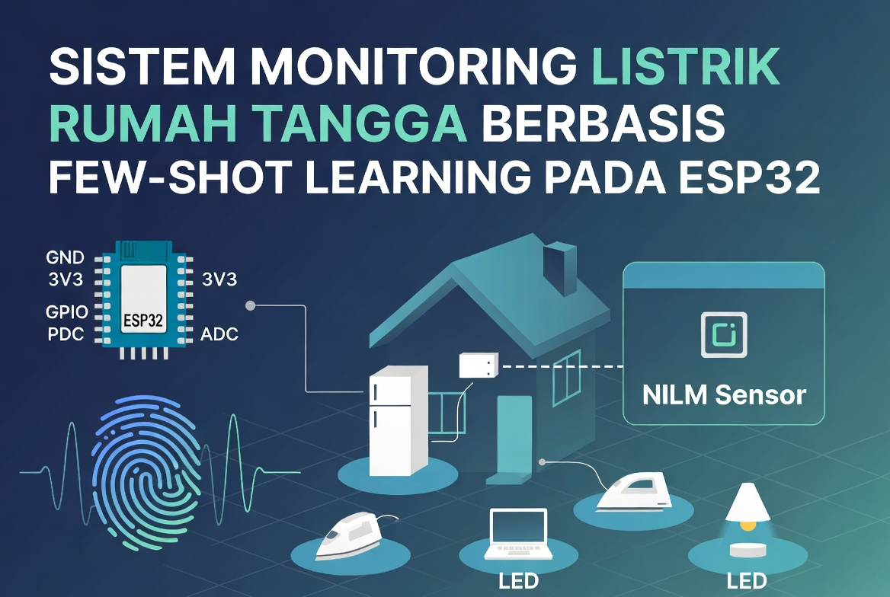
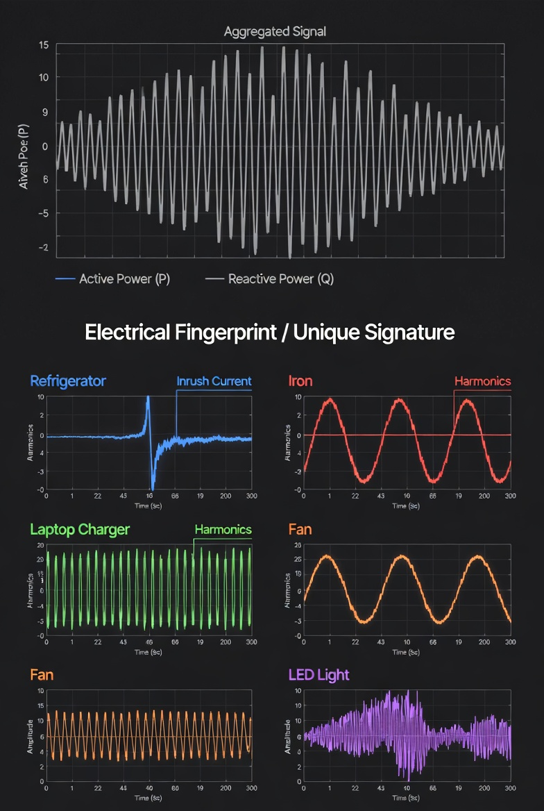

# Sistem Monitoring Listrik Rumah Tangga Berbasis Few-Shot Learning pada Mikrokontroler ESP32

> **Ide Penelitian :** Sistem NILM (Non Intrusive Load Monitoring) yang dapat mengenali status peralatan rumah tangga, dan beroperasi secara lokal di ESP32.

---

## Latar Belakang

Konsumsi energi listrik rumah tangga merupakan salah satu komponen vital dalam kehidupan sehari-hari. Namun demikian, sebagian besar rumah tangga tidak memiliki visibilitas yang memadai terhadap pola konsumsi energi mereka. Tagihan listrik bulanan hanya memberikan angka total tanpa merinci perangkat mana yang paling boros, kapan konsumsi puncak terjadi, atau apakah ada pemborosan yang tidak disadari.

Tagihan listrik meningkat dari bulan ke bulan, namun sulit menentukan perangkat mana yang paling banyak berkontribusi terhadap konsumsi tersebut. Sebuah studi menunjukkan bahwa umpan balik konsumsi per perangkat dapat **meningkatkan efisiensi energi rumah tangga hingga 15%** [Khan et al., 2019].

Keterbatasan visibilitas ini berdampak pada dua permasalahan utama. Pertama, pengguna tidak dapat mengambil keputusan berbasis data untuk mengurangi pemborosan energi. Kedua, deteksi dini kerusakan atau penurunan efisiensi perangkat seperti AC yang mulai membutuhkan daya lebih besar karena filter kotor atau kulkas yang kompresornya mulai melemah tidak dapat dilakukan secara proaktif.

Ini adalah permasalahan yang sangat umum di rumah tangga. Solusi yang dilakukan umumnya dengan memasang sub-meter atau smart plug di setiap stopkontak, namun pasti membutuhkan biaya yang tidak sedikit. Di sinilah ide NILM hadir sebagai solusi: **satu sensor di panel utama, informasi untuk semua perangkat**. Dengan menganalisis sinyal listrik agregat dari satu titik pengukuran ini, sistem NILM dapat mengidentifikasi perangkat individual yang sedang aktif berdasarkan **sidik jari listrik** (*electrical fingerprint*) yang unik untuk setiap perangkat meliputi daya aktif, karakteristik arus transien saat penyalaan, dan tingkat distorsi harmonik [Zoha et al., 2012].

Kemudian paradigma Few-Shot Learning (FSL) dipilih karena memungkinkan sistem untuk mengenali kelas baru dari contoh yang sedikit. [Mihailescu et al., 2020] mengembangkan sistem end-to-end few-shot NILM berbasis Arduino dengan biaya $77.59, di mana pengguna cukup menyalakan perangkat beberapa kali sebagai proses onboarding. [Ferraz et al.] menggunakan kombinasi Siamese Network dan KNN untuk mencapai akurasi 95.77% dengan kemampuan penambahan perangkat baru secara online.

---

## Konsep Dasar: Setiap Perangkat Memiliki "Sidik Jari" Kelistrikan

NILM pertama kali diusulkan oleh Hart [1992] dengan premis yang sederhana: setiap perangkat listrik meninggalkan **"sidik jari" elektrik yang unik** pada sinyal di panel utama. Sinyal tersebut dapat dimanifestasikan dalam berbagai bentuk [Zoha et al., 2012]:

- **Daya aktif (P) dan daya reaktif (Q)** — fitur paling mendasar
- **Harmonik arus** — efektif untuk beban non-linear [Srinivasan et al., 2006]
- **Trajektori Voltage-Current (V-I)** — Hubungan antara tegangan dan arus pada sebuah alat elektronik
- **Transien peralihan** : lonjakan arus sesaat saat perangkat pertama kali dinyalakan

Sebagai contoh konkret:

- **Setrika** mengonsumsi daya besar dengan sinyal arus yang hampir sinusoidal sempurna dan stabil tanpa lonjakan.
- **Kulkas** saat kompresornya mulai bekerja menghasilkan lonjakan arus yang sangat besar, bisa mencapai 5–7 kali arus normalnya, sebelum turun ke kondisi stabil.
- **Charger laptop** memiliki arus harmonik tinggi akibat rangkaian switching di dalamnya [Srinivasan et al., 2006].
- **Lampu LED** juga memiliki arus harmonik, namun dengan profil distribusi frekuensi yang berbeda dari charger [Zheng et al., 2018].

Penelitian di bidang NILM masih sangat aktif hingga saat ini. Zoha et al. [2012] mengklasifikasikan pendekatan NILM menjadi dua kelompok besar: **event-based** (deteksi peristiwa ketika nyala/mati nya alat elektronik) dan **state-based** (estimasi status perangkat secara kontinu). Untuk implementasi di perangkat *edge* dengan sumber daya terbatas, pendekatan event-based lebih dinilai efisien karena hanya membutuhkan komputasi saat ada perubahan beban [Kotsilitis & Marcoulaki, 2023].

---

## Celah Penelitian: NILM dinilai Belum "Personal"

Permasalahan fundamental NILM modern adalah **ketergantungan pada data berlabel dalam jumlah besar**. Model *deep learning* mutakhir sekalipun membutuhkan dataset dengan ratusan hingga ribuan jam rekaman dari berbagai rumah tangga [Athanasiadis et al., 2021]. Konsekuensinya:

- Model yang dilatih pada dataset publik (REDD, UK-DALE, REFIT) sering **gagal pada instalasi baru** karena perbedaan karakteristik perangkat antarmerek dan antargenerasi [Athanasiadis et al., 2021].
- Pengguna awam tidak mampu mengoperasikan pipeline/flow *machine learning* untuk menambahkan perangkat baru.
- Model besar tidak dapat berjalan di perangkat *edge* berbiaya rendah seperti ESP32 [Warden & Situnayake, 2019].

Pendekatan **self-adapting NILM** yang dikembangkan Wu et al. [2020] menawarkan alternatif, di mana sistem membangun *library signature* secara adaptif berdasarkan data personal bukan dari dataset umum, dan penelitian ini juga mengembangkan konsep lebih jauh dengan memperketat batasan resource komputasi hingga mampu berjalan level mikrokontroler.

---

## Pembeda Utama: Few-Shot Learning

Mengacu pada konsep **self-adapting NILM**, daripada memerlukan ribuan data untuk pelatihan, sistem ini dirancang agar dapat belajar dari **3–10 kali siklus nyala-mati** per perangkat yang dikenal dengan istilah **Few-shot learning**. *Few-shot learning* (FSL) merupakan paradigma *Machine Learning* di mana model mampu menggeneralisasi kelas baru dari hanya beberapa contoh (*N-way K-shot*, lazimnya K = 1 hingga 10) [Jia et al., 2024]. Dimana dalam konteks sistem ini sebagai contoh mengenalkan kulkas, maka yang dilakukan pengguna meliputi:

1. Pengguna menyalakan kulkas
2. Menekan tombol "Tambah Alat — Kulkas" di aplikasi
3. Sistem merekam "sidik jari" kelistrikannya
4. Proses tersebut diulangi 3–5 kali
5. Selesai — sistem harusnya bisa mengenali kulkas yang baru ditambahkan

Proses ini disebut **onboarding**. Jia et al. [2024] membuktikan bahwa *prototype network* berbasis trajektori V-I mampu mengklasifikasikan perangkat NILM **tanpa perlu retraining** ketika kelas baru ditambahkan.

---

## Fitur yang Digunakan: Pendekatan Berbasis Fisika Kelistrikan

Sebagian besar pendekatan FSL-NILM terkini berfokus pada representasi berbasis citra (trajektori V-I) atau sinyal mentah yang membutuhkan arsitektur neural network berat [Jia et al., 2024]. Pendekatan yang diusulkan di sini mengambil jalur berbeda: **mengekstraksi fitur yang secara fisika kelistrikan bermakna dan dapat diukur langsung**, lalu menerapkan FSL-KNN pada representasi yang jauh lebih ringan.

### `Φ = [P, Q, Inrush_ratio, H3, H5]`

**P — Daya Aktif:** Jumlah Watt yang benar-benar dikonsumsi. Fitur paling mendasar untuk membedakan kelas beban elektronik [Zoha et al., 2012].

**Q — Daya Reaktif:** Komponen ini membedakan beban *resistif* dari beban *induktif*. Motor kipas angin memiliki Q yang signifikan karena adanya induktansi dari kumparan stator. Setrika mendekati nol. Tanpa Q, setrika dan kulkas saat idle berpotensi tertukar karena daya aktifnya bisa serupa [Srinivasan et al., 2006].

**Inrush_ratio/Inrush_current:** Rasio antara arus puncak saat perangkat pertama kali dinyalakan terhadap arus steady-state-nya. Contoh dimana Kulkas dapat mencapai 5–7x arus normalnya, sedangkan setrika sekitar 1x, rice cooker sekitar 1x,1–1,3x. Srinivasan et al. [2006] mengidentifikasi transien peralihan sebagai fitur yang sangat diskriminatif untuk membedakan perangkat dengan daya aktif yang serupa.

**H3 dan H5 — Harmonik Orde 3 dan 5:** Srinivasan et al. [2006] membuktikan bahwa MLP yang dilatih pada **harmonik per-orde** mencapai akurasi identifikasi perangkat yang jauh lebih tinggi dibandingkan THD (*Total Harmonic Distortion*) agregat. Zheng et al. [2018] secara eksperimental memverifikasi bahwa harmonik per-orde H3 dan H5 memiliki **sifat aditif yang baik**, penting untuk kondisi di mana beberapa perangkat beroperasi secara bersamaan.

Awalnya penulis mencoba menggunakan THD agregat, namun karena beberapa referensi jurnal yang ada penulis mengubahnya dengan mencoba menambahkan tabel komparasi dari THD agregat dengan Harmonik Orde 3 dan 5. Beberapa alasan tidak menggunakan THD disebutkan dengan contoh dimana dua perangkat dengan profil harmonik yang sangat berbeda dapat menghasilkan nilai THD yang identik.

| Perangkat                | THD | H3  | H5  |
| -------------------------- | ----- | ----- | ----- |
| Charger laptop switching | 29% | 26% | 13% |
| Lampu LED (driver murah) | 28% | 9%  | 21% |

Dengan menggunakan THD, kedua perangkat ini tampak identik. Dengan H3 dan H5 secara terpisah, perbedaannya langsung terlihat jelas [Srinivasan et al., 2006].

### Harmonik Berorde: Konsep dan Mekanisme

Sinyal arus listrik ideal berbentuk gelombang sinusoidal murni pada frekuensi fundamental 50 Hz. Namun, perangkat elektronik modern khususnya yang menggunakan komponen non-linear seperti dioda, kapasitor, dan rangkaian switching menyebabkan bentuk gelombang arus menyimpang dari sinusoid murni. Penyimpangan ini tidak acak, secara matematis dapat diuraikan menjadi jumlahan sinusoid-sinusoid dengan frekuensi kelipatan bulat dari frekuensi fundamental, yang dikenal sebagai **deret Fourier**:

$$
i(t) = I_1\sin(\omega t + \phi_1) + I_3\sin(3\omega t + \phi_3) + I_5\sin(5\omega t + \phi_5) + \cdots

$$

Setiap suku dalam deret ini disebut **harmonik berorde** (*nth-order harmonic*):

| Orde | Nama          | Frekuensi (50 Hz sistem) | Sumber Umum                                           |
| ------ | --------------- | -------------------------- | ------------------------------------------------------- |
| H1   | Fundamental   | 50 Hz                    | Semua perangkat (komponen utama)                      |
| H2   | Harmonik ke-2 | 100 Hz                   | Arcing, asimetri rangkaian                            |
| H3   | Harmonik ke-3 | 150 Hz                   | Beban non-linear simetris (charger, lampu LED, motor) |
| H5   | Harmonik ke-5 | 250 Hz                   | Rectifier 6-pulsa, drive motor, switching PSU         |
| H7   | Harmonik ke-7 | 350 Hz                   | Drive frekuensi variabel, UPS                         |
| H9   | Harmonik ke-9 | 450 Hz                   | Transformator jenuh, beban tiga fase                  |

**Mengapa harmonik ganjil (odd) dominan?** Untuk beban yang memiliki simetri setengah gelombang (*half-wave symmetry*), yaitu bentuk gelombang bagian positif dan negatifnya identik secara matematika hanya harmonik orde ganjil yang dapat eksis. Hampir semua perangkat elektronik rumah tangga memenuhi simetri ini, sehingga H2, H4, H6 (orde genap) nilainya mendekati nol dan tidak memberikan informasi pembeda yang berguna.

**Amplitudo harmonik sebagai sidik jari perangkat.** Nilai $I_n$ (amplitudo orde ke-n) mencerminkan seberapa besar komponen frekuensi tersebut ada dalam arus yang ditarik perangkat. Setiap desain sirkuit internal menghasilkan "resep" amplitudo harmonik yang unik:

- **Charger laptop switching (SMPS):** Kapasitor input besar mengambil arus hanya di puncak tegangan → H3 sangat tinggi (~26%), H5 sedang (~13%). Pola ini disebut *peaky current waveform*.
- **Lampu LED dengan driver murah:** Rectifier sederhana tanpa power factor correction → H3 relatif rendah (~9%), H5 lebih tinggi (~21%). Distribusi antar-orde sangat berbeda dari charger.
- **Motor induksi (kipas angin):** Beban hampir linear namun ada slip dan saturasi magnetik → H3 dan H5 ada namun kecil, Q (daya reaktif) menjadi fitur pembeda utama.
- **Setrika resistif:** Elemen pemanas murni resistif → sinusoidal sempurna, H3 ≈ H5 ≈ 0%.

**Sifat aditif harmonik berorde.** Saat beberapa perangkat menyala bersamaan, amplitudo harmonik total di panel utama adalah **penjumlahan vektor** dari kontribusi masing-masing perangkat (dengan mempertimbangkan sudut fase). Zheng et al. [2018] membuktikan secara eksperimental bahwa H3 dan H5 memiliki **sifat aditif yang cukup baik** untuk kondisi multi-perangkat, memungkinkan dekomposisi kontribusi individual dari sinyal agregat — properti yang tidak dimiliki fitur berbasis statistik temporal.

**THD vs. Harmonik Per-Orde.** *Total Harmonic Distortion* (THD) merupakan agregasi semua harmonik menjadi satu angka:

$$
\text{THD} = \frac{\sqrt{I_3^2 + I_5^2 + I_7^2 + \cdots}}{I_1} \times 100\%
$$

Informasi distribusi antar orde hilang dalam proses penjumlahan ini. Dua perangkat dengan "resep" harmonik yang sangat berbeda dapat menghasilkan THD identik (seperti contoh tabel di atas: charger 29% vs. lampu LED 28%), sehingga THD tidak dapat membedakan keduanya. Inilah mengapa Srinivasan et al. [2006] merekomendasikan penggunaan harmonik per-orde sebagai fitur terpisah, bukan THD agregat.

### Mengapa Hanya H3 dan H5 ?

Asalannya adalah keterbatasan hardware, dimana penulis menggunakan sensor ADC (Analog Digital Converter) dengan tipe ADS1115 yang mampu mengambil sampai 860 SPS (sample per second), dan memiliki bandwidth efektif ~430 Hz. Kotsilitis et al. [2023] menunjukkan bahwa frekuensi sampling **1–4 kHz** sudah mencukupi untuk deteksi event dan ekstraksi harmonik hingga orde tertentu. Namun dengan ADS1115 single-channel pada 860 SPS, batas Nyquist (~430 Hz) membuat H7 (350 Hz) berada di dekat batas dan H9 (450 Hz) melewatinya — menghasilkan nilai yang tidak reliabel akibat aliasing. Oleh karenanya Ekstraksi fitur dibatasi pada H3 (150 Hz) dan H5 (250 Hz) yang dapat diukur secara akurat.

---

## Spesifikasi Hardware

Total biaya prototipe sekitar **Rp246.000**. Da Costa Filho et al. [2025] membuktikan kelayakan deployment model MLP dan KNN langsung pada ESP32 untuk klasifikasi beban IoT, menegaskan bahwa ESP32 mampu menjalankan inferensi NILM ringan secara real-time — dengan catatan ADC presisi eksternal digunakan untuk akuisisi sinyal.

| Komponen                            | Harga Estimasi |
| ------------------------------------- | ---------------- |
| ESP32 DevKit V1                     | Rp 45.000      |
| ADS1115 (2 buah)                    | Rp 50.000      |
| HSTS016L — sensor arus Hall Effect | Rp 95.000      |
| ZMPT101B — sensor tegangan         | Rp 25.000      |
| Komponen pendukung                  | Rp 31.200      |

**Mengapa dua unit ADS1115?** Satu chip ADC hanya dapat mengukur satu channel per konversi (~1,2 ms). Dengan dua chip pada alamat I2C berbeda, tegangan dan arus dapat diukur **secara bersamaan** pada 860 sampel/detik masing-masing akurasi ekstraksi harmonik via algoritma Goertzel menjadi jauh lebih baik [Kotsilitis et al., 2023].

**Mengapa ADS1115 dan bukan ADC internal ESP32?** ADC internal ESP32 (12-bit) dikenal sangat *noisy* dan non-linear, terutama ketika digunakan bersama Wi-Fi aktif. Noise ADC internal dapat mencapai ±30 LSB, yang lebih besar dari amplitudo harmonik H3/H5 yang ingin diukur. ADS1115 (16-bit, SNR ~86 dB) menjadi komponen wajib [da Costa Filho et al., 2025].

---

## Arsitektur Sistem

Sistem ini dirancang secara sederhana namun dapat ditingkatkan sesuai kebutuhan. Hierarki ini mengacu pada framework tiga tier yang dikembangkan berdasarkan literatur terkait [Ferraz et al., 2022; Jia et al., 2024].

### Tier 1 — KNN Langsung

Merupakan pilihan utama penelitian. Sistem ini tidak memerlukan model machine learning sama sekali. Support set di Flash menyimpan langsung vektor `Φ` yang direkam saat onboarding. Inferensi dilakukan dengan menghitung jarak Euclidean ke semua contoh tersimpan, mengambil 3 tetangga terdekat, dan melakukan majority vote. Khan et al. [2019] memvalidasi pendekatan KNN (K=5) untuk NILM; da Costa Filho et al. [2025] mengkonfirmasi kelayakan deployment langsung di ESP32.

| Parameter          | Nilai   |
| -------------------- | --------- |
| Ukuran model       | 0 KB    |
| RAM saat inferensi | < 1 KB  |
| Waktu inferensi    | < 1 ms  |
| Estimasi akurasi   | 75–82% |

### Tier 2 — MLP Encoder + KNN

Merupakan model alternatif yang dipilih, dengan menambahkan Encoder MLP berukuran kecil (~400 parameter, ~1,6 KB setelah kuantisasi INT8) yang dilatih secara *offline* di laptop menggunakan dataset NILM publik. Proses pelatihan menggunakan *episodic meta-learning* secara prinsip identik dengan Prototype Networks dalam literatur few-shot learning. Chen et al. [2022] membuktikan bahwa pendekatan pre-training + few-shot fine-tuning menghasilkan transferabilitas yang superior dibandingkan deep learning konvensional pada dataset REDD dan UK-DALE. Model di-deploy ke ESP32, dan KNN beroperasi di ruang embedding yang lebih diskriminatif.

| Parameter          | Nilai   |
| -------------------- | --------- |
| Ukuran model       | ~3 KB   |
| RAM saat inferensi | < 5 KB  |
| Waktu inferensi    | < 3 ms  |
| Estimasi akurasi   | 82–88% |

Ini merupakan **novelty utama** dari penelitian ini: encoder yang 50–100 kali lebih kecil dibandingkan CNN berbasis trajektori V-I pada Jia et al. [2024], namun sudah cukup untuk meningkatkan akurasi secara signifikan.

### Tier 3 — Siamese Network + KNN (Lanjutan)

Ferraz et al. [2022] mengvalidasi arsitektur Siamese CNN + KNN untuk NILM berbasis citra V-I — pendekatan ini bekerja dengan baik bahkan dengan sangat sedikit contoh per kelas. Tier 3 mengadaptasi prinsip yang sama pada fitur fisika, dengan jaringan Siamese dilatih untuk mempelajari fungsi kemiripan antar pasang sinyal.

| Parameter          | Nilai      |
| -------------------- | ------------ |
| Ukuran model       | ~20–50 KB |
| RAM saat inferensi | < 10 KB    |
| Waktu inferensi    | ~10–30 ms |
| Estimasi akurasi   | 85–92%    |

---

## Tantangan yang Telah Diantisipasi

**"Simultaneous Turn-On Problem"** — Ketika listrik PLN kembali menyala setelah padam, semua perangkat dapat menyala bersamaan. Sinyal transien saling bertumpang tindih sehingga tidak memungkinkan identifikasi individual secara real-time. Solusinya: sistem menunggu kondisi steady-state tercapai, kemudian mencari kombinasi perangkat yang jumlah daya aktifnya sesuai dengan total daya terukur. Ini adalah *state re-synchronization*, bukan identifikasi real-time dan merupakan *limitation* yang perlu diakui dalam laporan penelitian [Zoha et al., 2012].

**"Identical Signature Problem"** — Dua kipas angin dengan merek dan seri yang sama akan menghasilkan feature vector yang hampir identik dari satu titik pengukuran. Secara fisika, keduanya memang tidak dapat dibedakan dari satu titik ukur [Zoha et al., 2012]. Sistem akan mengelompokkan keduanya ke dalam satu grup ("Kipas Angin Miyako — 2 unit aktif"). Ini merupakan keterbatasan yang disadari dan harus didokumentasikan sebagai *limitation*.

**Rice cooker vs. setrika** — Keduanya bersifat resistif dengan daya aktif yang serupa. Inrush_ratio menjadi pembeda utama. Srinivasan et al. [2006] mengidentifikasi durasi penggunaan sebagai fitur konfirmasi sekunder yang dapat digunakan apabila rasio inrush masih ambigu.

**Noise ADC dan reliabilitas harmonik** — ADC internal ESP32 terlalu noisy untuk mengekstrak harmonik kecil. Solusi: gunakan ADS1115 (16-bit eksternal) dan batasi ekstraksi harmonik ke H3 dan H5 saja sesuai batas Nyquist yang tersedia [Kotsilitis & Marcoulaki, 2023].

**Variasi kondisi operasional** — AC pada kondisi startup dingin vs. sudah hangat menghasilkan Inrush_ratio yang berbeda. Solusinya: rekam 3–5 contoh onboarding pada kondisi berbeda. Dengan K=3 contoh yang beragam di support set, KNN secara alami mempelajari *variance* normal perangkat tersebut [Chen et al., 2022].

---

## Mekanisme Onboarding dan Active Learning

Ketika terjadi event yang tidak dapat diidentifikasi, sistem menampilkan notifikasi "Uncategorized Load" pada dashboard beserta estimasi daya. Pengguna dapat memberi label, dan vektor fitur tersebut langsung ditambahkan ke support set tanpa retraining, tanpa gradient descent. Li et al. [2024] membuktikan bahwa model NILM dapat terus meningkat performanya dari data tidak berlabel pasca-onboarding (semi-supervised learning) prinsip serupa yang diterapkan di sini melalui mekanisme active learning berbasis konfirmasi pengguna.

  
---

## Signifikansi dan Posisi terhadap Literatur

Jia et al. [2024] adalah representasi terkini dari pendekatan V-I trajectory + FSL yang mencapai akurasi 90–95%, namun memerlukan sampling rate >10 kHz dan model CNN berukuran 80–200 KB. Ferraz et al. [2022] memvalidasi Siamese CNN + KNN pada NILM berbasis citra dengan hasil lebih dari 90% akurasi. Pendekatan yang diusulkan dalam penelitian ini mengambil jalur yang berbeda: fitur fisika yang sederhana namun bermakna, model yang sangat kecil, dan hardware yang terjangkau. Trade-off akurasi (75–88% vs. 90–95%) ditukar dengan **feasibility nyata** pada perangkat edge berbiaya rendah [da Costa Filho et al., 2025; Warden & Situnayake, 2019].

Pertanyaan penelitian yang perlu dijawab melalui eksperimen:

- Apakah 5 dimensi fitur fisika sudah cukup separable untuk perangkat rumah tangga yang umum di Indonesia? (Srinivasan et al. [2006] menunjukkan hal ini pada kondisi grid Singapura; validasi pada 220V/50Hz Indonesia diperlukan.)
- Berapa peningkatan akurasi dari Tier 1 ke Tier 2? Apakah encoder MLP 400 parameter memberikan nilai tambah yang signifikan dibanding hasil Chen et al. [2022]?
- Bagaimana performa sistem pada kondisi multi-beban? Zheng et al. [2018] memverifikasi sifat aditif harmonik sebagai landasan teoritis, namun validasi eksperimental lokal tetap diperlukan.
- Apakah dataset lokal Indonesia diperlukan, mengingat perbedaan grid (220V/50Hz) dibandingkan REDD/UK-DALE (120V/60Hz) yang digunakan pada sebagian besar benchmark? [Athanasiadis et al., 2021]

---

## Daftar Referensi

**[1]** Hart, G. W. (1992). Nonintrusive appliance load monitoring. *Proceedings of the IEEE*, *80*(12), 1870–1891.

**[2]** Zoha, A., Gluhak, A., Imran, M. A., & Rajasegarar, S. (2012). Non-intrusive load monitoring approaches for disaggregated energy sensing: A survey. *Sensors*, *12*(12), 16838–16866. https://doi.org/10.3390/s121216838

**[3]** Srinivasan, D., Ng, W. S., & Liew, A. C. (2006). Neural-network-based signature recognition for harmonic source identification. *IEEE Transactions on Power Delivery*, *21*(1), 398–405. https://doi.org/10.1109/TPWRD.2005.852370

**[4]** Iksan, N., Sembiring, J., Haryanto, N., & Supangkat, S. H. (2015). Appliances identification method of non-intrusive load monitoring based on load signature of V-I trajectory. *2015 International Conference on Information Technology Systems and Innovation (ICITSI)*. https://doi.org/10.1109/ICITSI.2015.7437744

**[5]** Zheng, Z., Chen, H., & Luo, X. (2018). A supervised event-based non-intrusive load monitoring for non-linear appliances. *Sustainability*, *10*(4), 1001. https://doi.org/10.3390/su10041001

**[6]** Wu, X., Jiao, D., & Du, Y. (2020). Automatic implementation of a self-adaption non-intrusive load monitoring method based on the convolutional neural network. *Processes*, *8*(6), 704. https://doi.org/10.3390/pr8060704

**[7]** Athanasiadis, C., Doukas, D., Papadopoulos, T., & Chrysopoulos, A. (2021). A scalable real-time non-intrusive load monitoring system for the estimation of household appliance power consumption. *Energies*, *14*(3), 767. https://doi.org/10.3390/en14030767

**[8]** Ferraz, F. C., Monteiro, R. V. A., Teixeira, R. F. S., & Bretas, A. S. (2022). Few-shot learning for image-based nonintrusive appliance signal recognition. *Hindawi*, 2142935. https://doi.org/10.1155/2022/2142935

**[9]** Chen, S., Zhao, B., Zhong, M., Luan, W., & Yu, Y. (2022). Non-intrusive load monitoring based on self-supervised learning. *arXiv*. https://doi.org/10.48550/arXiv.2210.04176

**[10]** Kotsilitis, S., & Marcoulaki, E. C. (2023). An efficient lightweight event detection algorithm for on-site non-intrusive load monitoring. *IEEE Transactions on Instrumentation and Measurement*, *72*, 1–13. https://doi.org/10.1109/TIM.2022.3232169

**[11]** Khan, M. M. R., Siddique, M. A. B., & Sakib, S. (2019). Non-intrusive electrical appliances monitoring and classification using K-Nearest Neighbors. *2019 2nd International Conference on Innovation in Engineering and Technology (ICIET)*, 1–5. https://doi.org/10.1109/ICIET48527.2019.9290671

**[12]** Jia, D., Li, Y., Du, Z., Xu, J., et al. (2024). A few-shot learning method for nonintrusive load monitoring with V–I trajectory features. *IEEE Sensors Journal*, *24*(7), 11867–11877. https://doi.org/10.1109/JSEN.2024.3365132

**[13]** Li, Y., Yang, Y., Sima, K., Li, B., et al. (2024). Semi-supervised learning with flexible threshold for non-intrusive load monitoring. *Heliyon*, *10*(14), e34457. https://doi.org/10.1016/j.heliyon.2024.e34457

**[14]** da Costa Filho, P. E., et al. (2025). Machine-learning-based classification of electronic devices using an IoT smart meter. *Informatics*, *12*(2), 48. https://doi.org/10.3390/informatics12020048

**[15]** Nieto, R., de Diego-Otón, L., Tapiador, M., Navarro, V. M., et al. (2026). Edge computing system-on-chip architecture for a non-intrusive load monitoring sensor in ambient intelligence applications. *Microprocessors and Microsystems*, *121*, 105250. https://doi.org/10.1016/j.micpro.2026.105250

**[16]** Warden, P., & Situnayake, D. (2019). *TinyML: Machine learning with TensorFlow Lite on Arduino and ultra-low-power microcontrollers*. O'Reilly Media.

---

*Ditulis dalam rangka penelitian tesis S2. Dataset hasil eksperimen akan dibagikan di repositori yang sama setelah proses pengambilan data selesai.*

*Hardware utama: ESP32 + 2× ADS1115 + HSTS016L + ZMPT101B — total ~Rp246.000*
