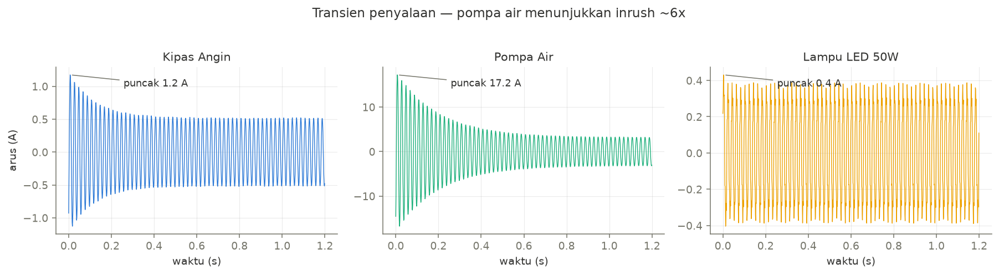
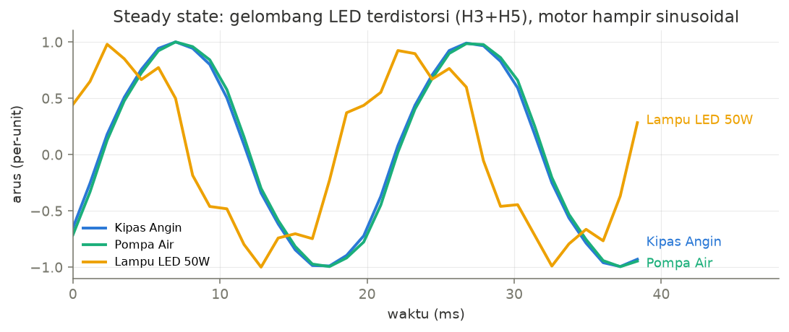
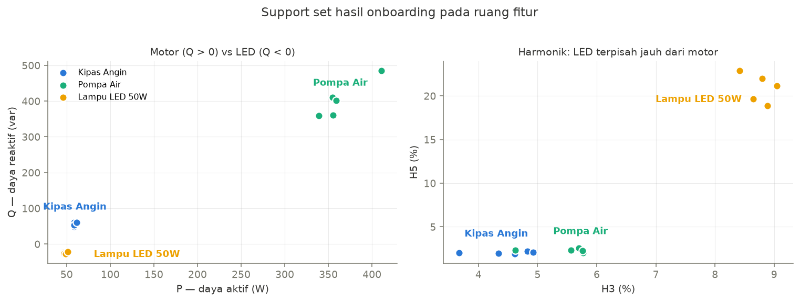
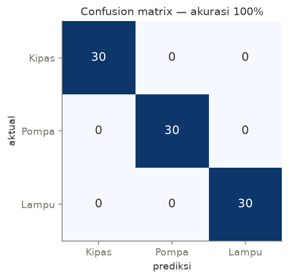

# Simulasi NILM — KNN Tier-1 + Algoritma Goertzel

Simulasi *proof-of-concept* dari arsitektur **Tier 1 (KNN Langsung)** pada
[README utama](../README.md): tiga peralatan rumah tangga (kipas angin, pompa air,
lampu LED 50 W) dikenali dari *electrical fingerprint* 5 dimensi
`Φ = [P, Q, Inrush_ratio, H3, H5]`, dengan harmonik H3/H5 diekstraksi via
**algoritma Goertzel** pada sinyal 860 SPS (meniru ADS1115).

## Cara Menjalankan

### 1. Google Colab — tanpa instalasi (direkomendasikan)

[](https://colab.research.google.com/github/hmdilham/brainstorming-project/blob/main/NILM%20Project/simulation/NILM_KNN_Simulation.ipynb)

Klik badge di atas → `Runtime ▸ Run all`. Notebook berisi penjelasan tiap tahap
beserta visualisasi (transien inrush, distorsi gelombang, ruang fitur, confusion
matrix).

### 2. GitHub Actions — otomatis di GitHub

Workflow [`nilm-simulation.yml`](../../.github/workflows/nilm-simulation.yml)
menjalankan versi skrip setiap kali ada perubahan di folder ini, atau manual via
tab **Actions ▸ NILM Simulation ▸ Run workflow**. Hasilnya (tabel fingerprint,
confusion matrix, akurasi) muncul di *job summary*.

### 3. Lokal

```bash
pip install numpy
python nilm_knn_simulation.py
```

## Isi

| File | Deskripsi |
|---|---|
| `NILM_KNN_Simulation.ipynb` | Notebook interaktif dengan penjelasan + grafik |
| `nilm_knn_simulation.py` | Versi skrip murni-numpy (dipakai CI), output teks |
| `assets/` | Gambar hasil simulasi yang disematkan di README ini |

## Hasil Ringkas

Pipeline: sinyal sintetis berbasis fisika → Goertzel @ 50/150/250 Hz → `Φ` →
onboarding 5-shot per perangkat → KNN (K=3, Euclidean, majority vote).

| Perangkat | P (W) | Q (var) | Inrush | H3 (%) | H5 (%) |
|---|---|---|---|---|---|
| Kipas angin | ~59 | ~56 | ~2.4× | ~4.5 | ~2.0 |
| Pompa air | ~364 | ~403 | ~5.5× | ~5.5 | ~2.3 |
| Lampu LED 50 W | ~49 | ~−25 | ~1.2× | ~8.8 | ~20.9 |

Akurasi 90 event uji: **100%** — jarak antar-centroid di ruang z-score ~10× lebih
besar dari sebaran intra-kelas. Catatan: ini *upper bound* pada sinyal sintetis;
estimasi realistis Tier 1 di README adalah 75–82%.

## Visualisasi Hasil

### 1. Transien penyalaan — fitur `Inrush_ratio`

Selubung arus 1,2 detik pertama tiap perangkat. Pompa air memperlihatkan lonjakan
khas motor induksi besar (puncak ~17 A, ~6× steady state), kipas angin lebih landai
(~2,5×), sedangkan LED praktis langsung steady.



### 2. Distorsi gelombang steady-state — fitur `H3`, `H5`

Dua siklus arus steady-state (per-unit). Kedua motor hampir sinusoidal murni,
sementara gelombang LED terdistorsi kuat oleh harmonik orde 3 dan 5 — inilah yang
ditangkap Goertzel di bin 150 Hz dan 250 Hz.



### 3. Ruang fitur — support set hasil onboarding

Dua proyeksi 2D dari fingerprint 5 dimensi. Panel kiri (P–Q): pompa terpisah oleh
daya, dan tanda Q memisahkan motor (induktif, Q > 0) dari LED (kapasitif, Q < 0).
Panel kanan (H3–H5): LED terpisah jauh dari kedua motor. Ketiga klaster kompak dan
tidak saling tumpang tindih — kondisi ideal untuk KNN.



### 4. Confusion matrix — 30 event uji per perangkat

Seluruh 90 event jatuh di diagonal: tidak ada satu pun kesalahan klasifikasi.


